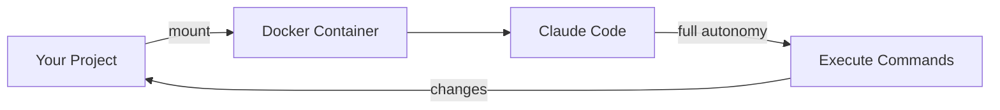

<div align="center">
  

  # claude-sandbox

  [](https://www.docker.com/)
  [](LICENSE)

  **🤖 Run Claude Code with full autonomy inside an isolated Docker container — let it code freely without touching your system**

  [Docker](https://docs.docker.com/get-docker/) · [Claude Code](https://claude.ai/code)
</div>

## Overview

claude-sandbox runs [Claude Code](https://claude.ai/code) with `--dangerously-skip-permissions` inside an isolated Docker container. This gives Claude full autonomy to install packages, run commands, and modify files — all safely contained without access to your host system.

## Features

- 🔒 **Isolated execution** — Claude runs in a container with no access to your host filesystem (except the mounted project)
- ⚡ **Full autonomy** — No permission prompts; Claude can execute any command inside the sandbox
- 📁 **Project mounting** — Your current directory is mounted as `/workspace` for Claude to work on
- 🛠️ **Simple setup** — One install script adds a shell function you can run from any project
- 🌍 **Cross-platform** — Works on any system with Docker (macOS, Linux, Windows with WSL)

## Quick Start

```bash
git clone https://github.com/tsilva/claude-sandbox.git
cd claude-sandbox
./install.sh
source ~/.zshrc  # or ~/.bashrc
```

Then authenticate once (uses your Claude Pro/Max subscription):

```bash
claude-sandbox login
```

And from any project directory:

```bash
cd ~/my-project
claude-sandbox
```

## Requirements

| Requirement | Details |
|-------------|---------|
| **Docker Desktop** | [Docker Desktop](https://docs.docker.com/get-docker/) installed and running (not Apple Container CLI) |
| **Claude Account** | Claude Pro or Max subscription |

> **Note**: This tool requires Docker Desktop, not the Apple Container CLI (`container` command). The Apple Container CLI has networking limitations that prevent Claude Code from connecting to Anthropic services.

## Commands

| Script | Purpose |
|--------|---------|
| `./install.sh` | Build image and add `claude-sandbox` shell function |
| `./build.sh` | Rebuild the container image |
| `./uninstall.sh` | Remove the container image |
| `./kill-containers.sh` | Force stop any running claude-sandbox containers |

## Authentication

claude-sandbox uses your Claude Pro/Max subscription instead of API keys. On first use, authenticate via browser:

```bash
claude-sandbox login
```

This opens a browser window for OAuth authentication. Your credentials are stored in `~/.claude-sandbox/` and persist across all container sessions — you only need to log in once.

## How It Works



1. **install.sh** builds a Docker image with Claude Code pre-installed
2. Running `claude-sandbox` starts a container with your current directory mounted
3. Claude Code runs with `--dangerously-skip-permissions` inside the isolated environment
4. All changes to `/workspace` are reflected in your project directory

## Troubleshooting

### "ETIMEDOUT" or "Unable to connect to Anthropic services"

This usually means you're using Apple Container CLI instead of Docker. Verify you're using Docker:

```bash
which docker  # Should show Docker path
type claude-sandbox  # Should show 'docker run', not 'container run'
```

If the function shows `container run`, update it to use `docker run` instead.

### "Configuration file corrupted" on first run

The `.claude.json` file needs to be valid JSON. Reset it:

```bash
echo '{}' > ~/.claude-sandbox/.claude.json
```

### Login doesn't persist

Make sure both config paths are mounted. Check your shell function includes:
- `-v ~/.claude-sandbox/claude-config:/home/claude/.claude`
- `-v ~/.claude-sandbox/.claude.json:/home/claude/.claude.json`

## License

MIT
