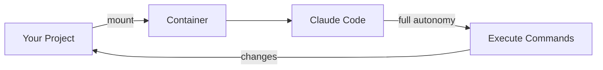

<div align="center">
  

  # claude-sandbox

  [](https://www.apple.com/macos/)
  [](https://support.apple.com/en-us/116943)
  [](LICENSE)

  **🤖 Run Claude Code with full autonomy inside an isolated container — let it code freely without touching your system**

  [Apple Container CLI](https://github.com/apple/container) · [Claude Code](https://claude.ai/code)
</div>

## Overview

claude-sandbox runs [Claude Code](https://claude.ai/code) with `--dangerously-skip-permissions` inside an isolated [Apple Container](https://github.com/apple/container) (lightweight Linux VM). This gives Claude full autonomy to install packages, run commands, and modify files — all safely contained without access to your host system.

## Features

- 🔒 **Isolated execution** — Claude runs in a container with no access to your host filesystem (except the mounted project)
- ⚡ **Full autonomy** — No permission prompts; Claude can execute any command inside the sandbox
- 📁 **Project mounting** — Your current directory is mounted as `/workspace` for Claude to work on
- 🛠️ **Simple setup** — One install script adds a shell function you can run from any project

## Quick Start

```bash
git clone https://github.com/tsilva/claude-sandbox.git
cd claude-sandbox
./install.sh
source ~/.zshrc  # or ~/.bashrc
```

Then from any project directory:

```bash
export ANTHROPIC_API_KEY="your-key"
cd ~/my-project
claude-sandbox
```

## Requirements

| Requirement | Details |
|-------------|---------|
| **macOS** | 26 (Tahoe) or later |
| **Chip** | Apple Silicon (M1/M2/M3/M4) |
| **Container CLI** | [Apple Container](https://github.com/apple/container) installed |
| **API Key** | `ANTHROPIC_API_KEY` environment variable |

## Commands

| Script | Purpose |
|--------|---------|
| `./install.sh` | Build image and add `claude-sandbox` shell function |
| `./build.sh` | Rebuild the container image |
| `./uninstall.sh` | Remove the container image |
| `./kill-containers.sh` | Force stop stuck containers (workaround for [apple/container#861](https://github.com/apple/container/issues/861)) |

## How It Works



1. **install.sh** builds a Docker image with Claude Code pre-installed
2. Running `claude-sandbox` starts a container with your current directory mounted
3. Claude Code runs with `--dangerously-skip-permissions` inside the isolated environment
4. All changes to `/workspace` are reflected in your project directory

## Troubleshooting

### Containers won't stop

Apple Container CLI has a [known bug](https://github.com/apple/container/issues/861) where stop commands don't work. Use the included workaround:

```bash
./kill-containers.sh
```

This directly unloads the launchd services to force stop containers.

## License

MIT
</div>
