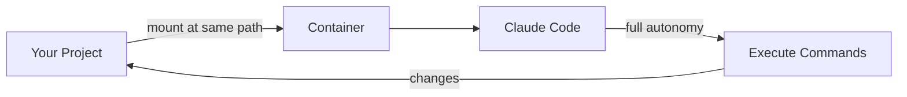

<div align="center">
  

  # claude-sandbox

  [](https://www.docker.com/)
  [](LICENSE)

  **🐳 Run Claude Code with full autonomy inside an isolated container — let it code freely without touching your system**

  [Docker](https://docs.docker.com/get-docker/) · [Claude Code](https://claude.ai/code)
</div>

---

## 📑 Table of Contents

- [✨ Features](#-features)
- [🚀 Quick Start](#-quick-start)
- [📋 Requirements](#-requirements)
- [🔐 Authentication](#-authentication)
- [💻 Usage](#-usage)
- [⚙️ Per-Project Configuration](#️-per-project-configuration)
- [🐳 Per-Project Dockerfile](#-per-project-dockerfile)
- [🛠️ Commands](#️-commands)
- [🔍 How It Works](#-how-it-works)
- [📁 Project Structure](#-project-structure)
- [🔧 Troubleshooting](#-troubleshooting)
- [🔔 Notifications](#-notifications)
- [📄 License](#-license)

## ✨ Features

- **🔒 Isolated execution** — Claude runs in a container with no access to your host filesystem (except mounted paths)
- **⚡ Full autonomy** — No permission prompts; Claude can execute any command inside the sandbox
- **📂 Same-path mounting** — Your project directory is mounted at its actual path, so file paths work identically inside and outside the container
- **🎛️ Per-project configuration** — Define additional mounts and ports via `.claude-sandbox.json` for data directories, output folders, and more
- **🏗️ Per-project Dockerfile** — Customize the container with project-specific dependencies using `.claude-sandbox.Dockerfile`
- **🧩 Plugin support** — Marketplace plugins from `~/.claude/plugins/marketplaces` are mounted read-only into the container
- **🎯 Simple setup** — One install script adds a shell function you can run from any project

## 🚀 Quick Start

```bash
git clone https://github.com/tsilva/claude-sandbox.git
cd claude-sandbox
./docker/install.sh
source ~/.zshrc  # or ~/.bashrc
```

Then authenticate once (uses your Claude Pro/Max subscription):

```bash
claude-sandbox login
```

Now head to any project directory and start coding:

```bash
cd ~/my-project
claude-sandbox
```

## 📋 Requirements

- [Docker Desktop](https://docs.docker.com/get-docker/) on macOS, Linux, or Windows with WSL
- **Optional:** `jq` for per-project configuration support (`brew install jq`)

## 🔐 Authentication

claude-sandbox uses your Claude Pro/Max subscription instead of API keys. On first use, authenticate via browser:

```bash
claude-sandbox login
```

This opens a browser window for OAuth authentication. Your credentials are stored in `~/.claude-sandbox/` and persist across all container sessions — you only need to log in once.

## 💻 Usage

```bash
# Run Claude Code in the sandbox
claude-sandbox

# Pass arguments to Claude (e.g., login)
claude-sandbox login

# Drop into a bash shell to inspect the sandbox environment
claude-sandbox shell

# With profiles (see Per-Project Configuration)
claude-sandbox --profile dev       # Use specific profile
claude-sandbox -p prod             # Short form
claude-sandbox --profile dev login # Profile + args to Claude
```

💡 The `shell` argument is useful for debugging or exploring what tools and files are available inside the container.

## ⚙️ Per-Project Configuration

Create a `.claude-sandbox.json` file in your project root to define named profiles with mounts and ports:

```json
{
  "dev": {
    "mounts": [
      { "path": "/Volumes/Data/input", "readonly": true },
      { "path": "/Volumes/Data/output" }
    ],
    "ports": [
      { "host": 3000, "container": 3000 },
      { "host": 5173, "container": 5173 }
    ]
  },
  "prod": {
    "mounts": [
      { "path": "/Volumes/Data/prod", "readonly": true }
    ]
  }
}
```

| Field | Required | Description |
|-------|----------|-------------|
| `<profile-name>` | Yes | Root-level keys are profile names |
| `mounts[].path` | Yes | Absolute host path (mounted to the same path inside container) |
| `mounts[].readonly` | No | If `true`, mount is read-only (default: `false`) |
| `ports[].host` | Yes | Host port number (1-65535) |
| `ports[].container` | Yes | Container port number (1-65535) |
| `git_readonly` | No | If `false`, disables read-only `.git` mount (default: `true`) |

🔒 **Git safety:** The `.git` directory is mounted read-only by default, preventing git write operations (`commit`, `push`, `add`) inside the container while allowing reads (`status`, `log`, `diff`). To allow git writes, set `"git_readonly": false` in your profile config.

**Profile selection:**
- **With `--profile`**: Use the specified profile directly
- **Without flag**: Interactive numbered menu

```bash
claude-sandbox --profile dev   # Use specific profile
claude-sandbox -p prod         # Short form
claude-sandbox                 # Interactive prompt to select profile
```

**Example use case:** A data processing project with dev and prod environments:

```json
{
  "dev": {
    "mounts": [
      { "path": "/Volumes/ExternalDrive/datasets", "readonly": true },
      { "path": "/Users/me/outputs" }
    ]
  },
  "prod": {
    "mounts": [
      { "path": "/Volumes/Production/data", "readonly": true }
    ]
  }
}
```

📝 **Note:** Requires `jq` to be installed. If `jq` is missing or the config file is invalid, extra mounts and ports are silently skipped and the sandbox runs normally.

## 🐳 Per-Project Dockerfile

Place a `.claude-sandbox.Dockerfile` in your project root to customize the container with project-specific dependencies. The file is a standard Dockerfile that builds on top of the base image:

```dockerfile
FROM claude-sandbox

RUN apt-get update && apt-get install -y python3 python3-pip
RUN pip3 install pandas
```

When present, a per-project image is automatically built before each run. This lets you pre-install tools, libraries, or system packages that your project needs without modifying the shared base image.

## 🛠️ Commands

| Script | Purpose |
|--------|---------|
| `./docker/install.sh` | Build image and add `claude-sandbox` shell function |
| `./docker/build.sh` | Rebuild the container image |
| `./docker/uninstall.sh` | Remove the container image |
| `./docker/kill-containers.sh` | Force stop any running containers |

## 🔍 How It Works



1. **install.sh** builds an OCI-compatible image with Claude Code pre-installed
2. Running `claude-sandbox` starts a container with your current directory mounted at its actual path
3. Claude Code runs with `--dangerously-skip-permissions` inside the isolated environment
4. All changes to the mounted directory are reflected in your project
5. Optional: `.claude-sandbox.json` adds extra mounts for data directories
6. Marketplace plugins from `~/.claude/plugins/marketplaces` are mounted read-only into the container

## 📁 Project Structure

```
claude-sandbox/
├── Dockerfile              # Shared OCI-compatible image definition
├── .dockerignore           # Files excluded from build context
├── scripts/
│   └── common.sh           # Shared functions for all runtime scripts
├── docker/                 # Docker runtime scripts
│   ├── config.sh           # Docker-specific configuration
│   ├── build.sh
│   ├── install.sh
│   ├── uninstall.sh
│   └── kill-containers.sh
├── CLAUDE.md
└── README.md
```

The `docker/` scripts are thin wrappers (~15 lines each) that set configuration variables and delegate to shared functions in `scripts/common.sh`.

## 🔧 Troubleshooting

### "ETIMEDOUT" or "Unable to connect to Anthropic services"

Verify Docker is running:

```bash
docker info  # Should show Docker daemon info
```

### "Configuration file corrupted" on first run

The `.claude.json` file needs to be valid JSON. Reset it:

```bash
echo '{}' > ~/.claude-sandbox/.claude.json
```

### Login doesn't persist

Make sure both config paths are mounted. Check your shell function includes:
- `-v ~/.claude-sandbox/claude-config:/home/claude/.claude`
- `-v ~/.claude-sandbox/.claude.json:/home/claude/.claude.json`

### Per-project mounts not working

1. Verify `jq` is installed: `which jq` or `brew install jq`
2. Validate your config: `jq . .claude-sandbox.json`
3. Check paths are absolute (start with `/`)

## 🔔 Notifications

For macOS desktop notifications when Claude is ready for input, install [claude-code-notify](https://github.com/tsilva/claude-code-notify) and enable sandbox support during its installation.

The notification bridge uses TCP (`host.docker.internal:19223`) to relay messages from the container to the host, where `terminal-notifier` displays them.

## 📄 License

MIT
