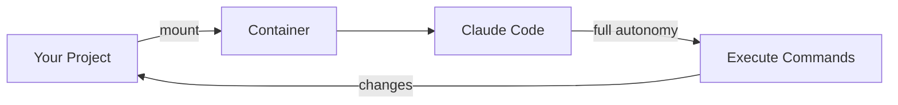

<div align="center">
  

  # claude-sandbox

  [](https://www.docker.com/)
  [](https://developer.apple.com/documentation/virtualization)
  [](LICENSE)

  **Run Claude Code with full autonomy inside an isolated container — let it code freely without touching your system**

  [Docker](https://docs.docker.com/get-docker/) · [Claude Code](https://claude.ai/code) · [Apple Container CLI](https://developer.apple.com/documentation/virtualization)
</div>

## Overview

claude-sandbox runs [Claude Code](https://claude.ai/code) with `--dangerously-skip-permissions` inside an isolated container. This gives Claude full autonomy to install packages, run commands, and modify files — all safely contained without access to your host system.

## Features

- **Isolated execution** — Claude runs in a container with no access to your host filesystem (except the mounted project)
- **Full autonomy** — No permission prompts; Claude can execute any command inside the sandbox
- **Project mounting** — Your current directory is mounted as `/workspace` for Claude to work on
- **Simple setup** — One install script adds a shell function you can run from any project
- **Multiple runtimes** — Choose Docker (cross-platform) or Apple Container CLI (macOS 26+)

## Quick Start

### Docker (Recommended)

```bash
git clone https://github.com/tsilva/claude-sandbox.git
cd claude-sandbox
./docker/install.sh
source ~/.zshrc  # or ~/.bashrc
```

Then authenticate once (uses your Claude Pro/Max subscription):

```bash
claude-sandbox login
```

And from any project directory:

```bash
cd ~/my-project
claude-sandbox
```

### Apple Container CLI (Experimental)

Requires macOS 26 (Tahoe) or later on Apple Silicon.

```bash
# Install Apple Container CLI
brew install --cask container
container system start

# Install claude-sandbox-apple
git clone https://github.com/tsilva/claude-sandbox.git
cd claude-sandbox
./apple/install.sh
source ~/.zshrc  # or ~/.bashrc
```

Then authenticate and use:

```bash
claude-sandbox-apple login
cd ~/my-project
claude-sandbox-apple
```

## Requirements

| Runtime | Requirements |
|---------|--------------|
| **Docker** (Recommended) | [Docker Desktop](https://docs.docker.com/get-docker/) on macOS, Linux, or Windows with WSL |
| **Apple Container** (Experimental) | macOS 26+, Apple Silicon (M1/M2/M3/M4), `brew install --cask container` |

## Commands

### Docker

| Script | Purpose |
|--------|---------|
| `./docker/install.sh` | Build image and add `claude-sandbox` shell function |
| `./docker/build.sh` | Rebuild the container image |
| `./docker/uninstall.sh` | Remove the container image |
| `./docker/kill-containers.sh` | Force stop any running containers |

### Apple Container CLI

| Script | Purpose |
|--------|---------|
| `./apple/install.sh` | Build image and add `claude-sandbox-apple` shell function |
| `./apple/build.sh` | Rebuild the container image |
| `./apple/uninstall.sh` | Remove the container image |
| `./apple/kill-containers.sh` | Force stop any running containers |

## Authentication

claude-sandbox uses your Claude Pro/Max subscription instead of API keys. On first use, authenticate via browser:

```bash
claude-sandbox login        # Docker
claude-sandbox-apple login  # Apple Container
```

This opens a browser window for OAuth authentication. Your credentials are stored in `~/.claude-sandbox/` and persist across all container sessions — you only need to log in once.

## How It Works



1. **install.sh** builds an OCI-compatible image with Claude Code pre-installed
2. Running `claude-sandbox` (or `claude-sandbox-apple`) starts a container with your current directory mounted
3. Claude Code runs with `--dangerously-skip-permissions` inside the isolated environment
4. All changes to `/workspace` are reflected in your project directory

## Troubleshooting

### Docker: "ETIMEDOUT" or "Unable to connect to Anthropic services"

This usually means you're using Apple Container CLI instead of Docker. Verify you're using Docker:

```bash
which docker  # Should show Docker path
type claude-sandbox  # Should show 'docker run', not 'container run'
```

If the function shows `container run`, update it to use `docker run` instead, or use the dedicated `claude-sandbox-apple` function for Apple Container.

### "Configuration file corrupted" on first run

The `.claude.json` file needs to be valid JSON. Reset it:

```bash
echo '{}' > ~/.claude-sandbox/.claude.json
```

### Login doesn't persist

Make sure both config paths are mounted. Check your shell function includes:
- `-v ~/.claude-sandbox/claude-config:/home/claude/.claude`
- `-v ~/.claude-sandbox/.claude.json:/home/claude/.claude.json`

### Apple Container: Networking issues

Apple Container CLI may have networking limitations depending on macOS version. If you experience connectivity issues, try Docker instead or ensure you're running macOS 26 (Tahoe) or later.

## License

MIT
