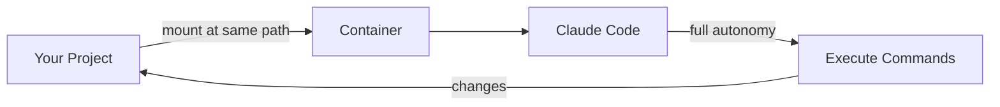

<div align="center">
  

  [](https://github.com/tsilva/claudebox/actions)
  [](https://www.docker.com/)
  [](LICENSE)
  [](https://github.com/tsilva/claudebox/commits/main)
  [](https://github.com/tsilva/claudebox)

  **🔒 Let AI code autonomously. Without fear.**

  > *"I gave Claude full autonomy and watched it refactor my codebase. My system? Untouched."*

  

  [Docker](https://docs.docker.com/get-docker/) · [Claude Code](https://claude.ai/code)
</div>

---

## Table of Contents

- [Features](#-features)
- [Why claudebox?](#-why-claudebox)
- [Quick Start](#-quick-start)
- [Requirements](#-requirements)
- [Authentication](#-authentication)
- [Usage](#-usage)
- [Per-Project Configuration](#%EF%B8%8F-per-project-configuration)
- [Per-Project Dockerfile](#-per-project-dockerfile)
- [Commands](#%EF%B8%8F-commands)
- [How It Works](#-how-it-works)
- [Sandbox Awareness](#-sandbox-awareness)
- [Project Structure](#-project-structure)
- [Resource Limits](#-resource-limits)
- [Troubleshooting](#-troubleshooting)
- [Notifications](#-notifications)
- [Security](#%EF%B8%8F-security)
- [Community](#-community)
- [License](#-license)

## ✨ Features

- **🔒 Isolated execution** — Claude runs in a container with no access to your host filesystem (except mounted paths)
- **⚡ Full autonomy** — No permission prompts; Claude can execute any command inside the sandbox
- **🧠 Sandbox awareness** — Claude automatically knows its constraints (read-only paths, blocked directories, resource limits)
- **📁 Same-path mounting** — Your project directory is mounted at its actual path, so file paths work identically inside and outside the container
- **⚙️ Per-project configuration** — Define additional mounts and ports via `.claudebox.json` for data directories, output folders, and more
- **🐳 Per-project Dockerfile** — Customize the container with project-specific dependencies using `.claudebox.Dockerfile`
- **🔌 Plugin support** — Marketplace plugins from `~/.claude/plugins/marketplaces` are mounted read-only into the container
- **🚀 Simple setup** — One install script adds a standalone command you can run from any project

## 🤔 Why claudebox?

**The problem:** Claude Code with `--dangerously-skip-permissions` can modify any file on your system. One wrong command and your SSH keys, git config, or system files could be gone.

**The solution:** claudebox runs Claude Code in a Docker container where it has full autonomy *inside the sandbox*, but zero access to your host system except the mounted project directory.

| Without sandbox | With sandbox |
|-----------------|--------------|
| Claude can `rm -rf ~/*` | Claude can only modify your project |
| Claude can read `~/.ssh/*` | No access to SSH keys |
| Claude can modify `~/.gitconfig` | No access to git credentials |
| One mistake = system damage | One mistake = rebuild container |

**TL;DR:** Full AI autonomy, zero host risk.

## 🚀 Quick Start

**Option 1: One-liner install**
```bash
curl -fsSL https://raw.githubusercontent.com/tsilva/claudebox/main/install.sh | bash
```

**Option 2: Manual install**
```bash
git clone https://github.com/tsilva/claudebox.git
cd claudebox
./claudebox-dev.sh install
```

Then reload your shell and authenticate once (uses your Claude Pro/Max subscription):

```bash
claudebox login
```

Now head to any project directory and start coding:

```bash
cd ~/my-project
claudebox
```

## 📋 Requirements

- [Docker Desktop](https://docs.docker.com/get-docker/) on macOS (Linux/WSL2 not yet supported)
- **Optional:** `jq` for per-project configuration support (`brew install jq`)

## 🔑 Authentication

claudebox uses your Claude Pro/Max subscription instead of API keys. On first use, authenticate via browser:

```bash
claudebox login
```

This opens a browser window for OAuth authentication. Your credentials are stored in `~/.claudebox/` and persist across all container sessions — you only need to log in once.

## 💻 Usage

```bash
# Run Claude Code in the sandbox (interactive mode)
claudebox

# Pass arguments to Claude (e.g., login)
claudebox login

# Non-interactive print mode: run a prompt and exit
claudebox -p "explain this code"
claudebox --print "what does main.py do"

# Pipe input to print mode
cat README.md | claudebox -p "summarize this"

# Print mode with output format for scripting
claudebox -p --output-format json "list all functions"

# Drop into a bash shell to inspect the sandbox environment
claudebox shell

# With profiles (see Per-Project Configuration)
claudebox --profile dev       # Use specific profile
claudebox -P prod             # Short form (-P uppercase)
claudebox --profile dev login # Profile + args to Claude

# Combine profile with print mode
claudebox -P dev -p "run tests"

# Mount all host paths as read-only (workspace, config, extra mounts)
claudebox --readonly

# Print the full docker run command without executing
claudebox --dry-run
```

The `shell` argument is useful for debugging or exploring what tools and files are available inside the container.

**Print mode** (`-p` / `--print`) runs non-interactively, executes the prompt, and exits. This is useful for scripting and automation.

## ⚙️ Per-Project Configuration

Create a `.claudebox.json` file in your project root to define named profiles with mounts and ports:

```json
{
  "dev": {
    "mounts": [
      { "path": "/Volumes/Data/input", "readonly": true },
      { "path": "/Volumes/Data/output" }
    ],
    "ports": [
      { "host": 3000, "container": 3000 },
      { "host": 5173, "container": 5173 }
    ]
  },
  "prod": {
    "mounts": [
      { "path": "/Volumes/Data/prod", "readonly": true }
    ]
  }
}
```

| Field | Required | Description |
|-------|----------|-------------|
| `<profile-name>` | Yes | Root-level keys are profile names |
| `mounts[].path` | Yes | Absolute host path (mounted to the same path inside container) |
| `mounts[].readonly` | No | If `true`, mount is read-only (default: `false`) |
| `ports[].host` | Yes | Host port number (1-65535) |
| `ports[].container` | Yes | Container port number (1-65535) |
| `network` | No | Docker network mode: `"bridge"` (default) or `"none"` for isolation |
| `audit_log` | No | If `true`, saves session logs to `~/.claudebox/logs/` (default: `false`) |
| `cpu` | No | CPU limit (e.g., `"4"`) — maps to `docker --cpus` |
| `memory` | No | Memory limit (e.g., `"8g"`) — maps to `docker --memory` |
| `pids_limit` | No | Max processes (e.g., `256`) — maps to `docker --pids-limit` |
| `ulimit_nofile` | No | Open file descriptors limit (e.g., `"1024:2048"`) |
| `ulimit_fsize` | No | Max file size in bytes (e.g., `1073741824`) |

**Git safety:** When running from a git repository, the `.git` directory is mounted read-only, preventing commits and other write operations. No SSH keys or git credentials are available in the container, so pushes will also fail. When running outside a git repo, a warning is displayed.

**Profile selection:**
- **With `--profile` or `-P`**: Use the specified profile directly
- **Without flag**: Interactive numbered menu

```bash
claudebox --profile dev   # Use specific profile
claudebox -P prod         # Short form (-P uppercase)
claudebox                 # Interactive prompt to select profile
```

> **Note:** The `-P` (uppercase) flag is used for profiles to avoid collision with Claude's `-p` (lowercase) print mode flag.

**Example use case:** A data processing project with dev and prod environments:

```json
{
  "dev": {
    "mounts": [
      { "path": "/Volumes/ExternalDrive/datasets", "readonly": true },
      { "path": "/Users/me/outputs" }
    ]
  },
  "prod": {
    "mounts": [
      { "path": "/Volumes/Production/data", "readonly": true }
    ]
  }
}
```

**Note:** Requires `jq` to be installed. If `jq` is missing or the config file is invalid, extra mounts and ports are skipped with a warning and the sandbox runs normally.

## 🐳 Per-Project Dockerfile

Place a `.claudebox.Dockerfile` in your project root to customize the container with project-specific dependencies. The file is a standard Dockerfile that builds on top of the base image:

```dockerfile
FROM claudebox

RUN apt-get update && apt-get install -y python3 python3-pip
RUN pip3 install pandas
```

When present, a per-project image is automatically built before each run. This lets you pre-install tools, libraries, or system packages that your project needs without modifying the shared base image.

## 🛠️ Commands

| Command | Purpose |
|---------|---------|
| `./claudebox-dev.sh install` | Build image and install `claudebox` script to `~/.claudebox/bin/` |
| `./claudebox-dev.sh build` | Rebuild the container image |
| `./claudebox-dev.sh update` | Pull latest changes and rebuild |
| `./claudebox-dev.sh uninstall` | Remove the container image |
| `./claudebox-dev.sh kill` | Force stop any running containers |

## 🔧 How It Works



1. **`claudebox-dev.sh install`** builds an OCI-compatible image and installs a standalone script to `~/.claudebox/bin/`
2. Running `claudebox` starts a container with your current directory mounted at its actual path
3. Claude Code runs with `--dangerously-skip-permissions` inside the isolated environment
4. All changes to the mounted directory are reflected in your project
5. Optional: `.claudebox.json` adds extra mounts for data directories
6. Marketplace plugins from `~/.claude/plugins/marketplaces` are mounted read-only into the container

## 🧠 Sandbox Awareness

At container startup, claudebox generates a `CLAUDE.md` file at `~/.claude/CLAUDE.md` inside the container. Claude Code automatically loads this file, making the AI aware of its environment constraints:

- **Filesystem restrictions** — Read-only root filesystem, writable locations (`/tmp`, `~/.cache`, etc.)
- **Blocked paths** — No access to `~/.ssh`, `~/.aws`, `~/.gnupg`, and other sensitive directories
- **Git restrictions** — `.git` directory is read-only; commits and pushes are blocked
- **Profile settings** — Network mode, CPU/memory limits, extra mounts with access modes

This prevents Claude from attempting operations that would fail (like `git push` without credentials) and helps it work within the sandbox constraints.

## 📁 Project Structure

```
claudebox/
├── Dockerfile              # OCI-compatible image definition
├── .dockerignore           # Files excluded from build context
├── entrypoint.sh           # Container entrypoint (sandbox awareness, venv activation)
├── install.sh              # One-liner curl install script
├── claudebox-dev.sh        # Dev CLI (build/install/uninstall/kill/update)
├── scripts/
│   ├── claudebox-template.sh   # Standalone script template
│   ├── install-claude-code.sh  # Claude Code installer
│   └── seccomp.json            # Syscall filtering profile
├── tests/
│   ├── smoke-test.sh           # Basic functionality tests
│   ├── isolation-test.sh       # Filesystem isolation tests
│   ├── security-regression.sh  # Security constraint tests
│   ├── validation-test.sh      # Config validation tests
│   ├── golden/                 # Expected output fixtures
│   └── lib/                    # Test utilities
├── .github/workflows/
│   └── ci.yml              # Shellcheck + build CI
├── SECURITY.md
├── CLAUDE.md
└── README.md
```

## 📊 Resource Limits

By default, containers run without resource limits. To restrict CPU, memory, or processes, add the fields to your `.claudebox.json` profile:

```json
{
  "dev": {
    "cpu": "4",
    "memory": "8g",
    "pids_limit": 256,
    "ulimit_nofile": "1024:2048",
    "ulimit_fsize": 1073741824
  }
}
```

## 🔍 Troubleshooting

### Docker not running

If you see "daemon is not running", start Docker Desktop:

```bash
docker info  # Should show Docker daemon info
```

### "ETIMEDOUT" or "Unable to connect to Anthropic services"

This usually indicates network issues inside the container. Verify Docker has internet access:

```bash
claudebox shell
# Inside container:
curl -I https://api.anthropic.com
```

### Permission denied / UID mismatch

The container user UID is set at build time to match your host user. If you see permission errors on mounted files, rebuild:

```bash
./claudebox-dev.sh build  # Rebuilds with your current UID
```

### "Configuration file corrupted" on first run

The `.claude.json` file needs to be valid JSON. Reset it:

```bash
echo '{}' > ~/.claudebox/.claude.json
```

### Login doesn't persist

Make sure both config paths are mounted. Check the generated script includes:
- `-v ~/.claudebox/claude-config:/home/claude/.claude`
- `-v ~/.claudebox/.claude.json:/home/claude/.claude.json`

### Per-project mounts not working

1. Verify `jq` is installed: `which jq` or `brew install jq`
2. Validate your config: `jq . .claudebox.json`
3. Check paths are absolute (start with `/`)
4. Ensure mount paths exist on the host (see `mkdir -p` hint in warnings)

### Port conflicts

If a port is already in use on the host, you'll see a bind error. Change the host port in `.claudebox.json` or stop the conflicting process:

```bash
lsof -i :3000  # Find what's using the port
```

### Docker not enough resources

If builds or runs fail with out-of-memory errors, increase Docker Desktop's resource allocation in **Settings > Resources**.

## 🔔 Notifications

For macOS desktop notifications when Claude is ready for input, install [claude-code-notify](https://github.com/tsilva/claude-code-notify) and enable sandbox support during its installation.

The notification bridge uses TCP (`host.docker.internal:19223`) to relay messages from the container to the host, where `terminal-notifier` displays them.

## 🛡️ Security

See [SECURITY.md](SECURITY.md) for details on the isolation model, what is and isn't protected, and how to report vulnerabilities.

## 🌍 Community

Share your builds with **#claudebox** on Twitter/X

---

<div align="center">

⭐ **If claudebox saved you from AI-induced system damage, consider starring the repo!**

</div>

## 📄 License

MIT
