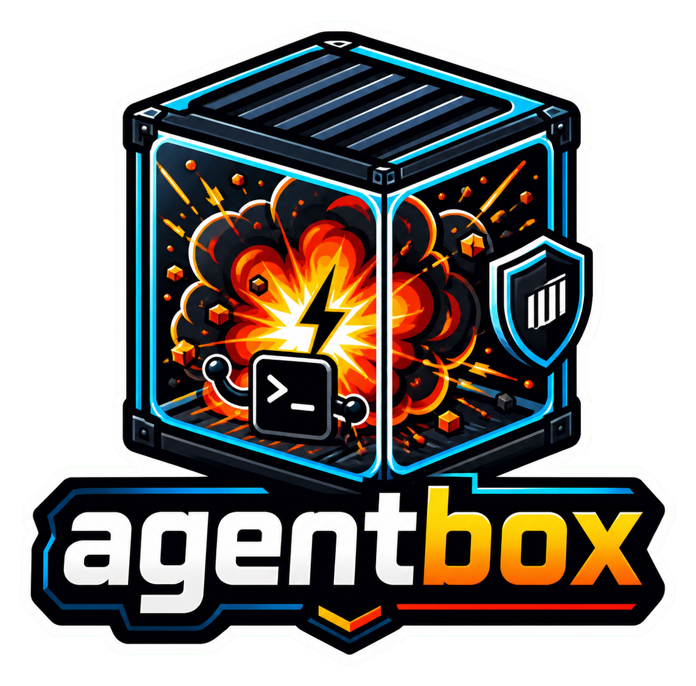
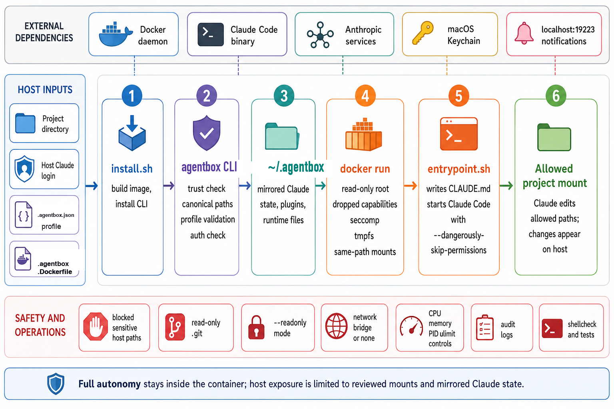

<div align="center">
  

  **⚡ Full autonomy. Zero blast radius. 🛡️**
</div>

agentbox runs Claude Code or Codex with full autonomy inside an isolated Docker container. The coding agent can work without permission prompts inside the sandbox, while sensitive host paths, git credentials, and system files stay outside the container boundary.

Use it from any project directory when you want an agent to move quickly with Docker-backed filesystem, network, process, and mount controls.

## Install

Requires Docker installed and running. On macOS, Docker Desktop is the standard setup.

```bash
curl -fsSL https://raw.githubusercontent.com/tsilva/agentbox/main/install.sh | bash
```

Or install from a local checkout:

```bash
git clone https://github.com/tsilva/agentbox.git
cd agentbox
./install.sh
```

Reload your shell, or update `PATH` for the current session:

```bash
export PATH="$HOME/.agentbox/bin:$PATH"
```

Then run agentbox from the project you want to sandbox:

```bash
cd /path/to/project
agentbox trust
agentbox --claude
```

For Codex, run:

```bash
agentbox --codex
```

Host auth is required before launch. For Claude, run `claude` on the host and complete `/login`. For Codex, run `codex login` on the host or export `OPENAI_API_KEY`.

## Commands

```bash
agentbox --claude                            # start Claude Code in the sandbox
agentbox --claude -p "explain this code"     # run Claude non-interactively
cat README.md | agentbox --claude -p "summarize this"
agentbox --claude shell                      # inspect the sandbox with bash

agentbox --codex                             # start Codex in the sandbox
agentbox --codex -p "explain this code"      # run Codex non-interactively
agentbox --runtime codex exec "run tests"    # pass native Codex subcommands

agentbox trust                               # trust the current canonical project path
agentbox trust --list                        # list trusted project paths
agentbox untrust                             # remove trust for the current project path

agentbox --claude --profile dev              # launch with a .agentbox.json profile
agentbox --codex -P dev -p "run tests"       # combine profile and print mode
agentbox --claude --readonly                 # mount host-backed paths read-only
agentbox --claude --dry-run                  # print the docker run command
agentbox --claude --allow-project-dockerfile # allow a reviewed .agentbox.Dockerfile
agentbox update                              # update the installed script and image
```

Development commands from this repo:

```bash
./scripts/agentbox-dev.sh build              # build the Docker image
./scripts/agentbox-dev.sh install            # build and install the CLI
./scripts/agentbox-dev.sh kill               # stop running agentbox containers
./scripts/lint.sh                            # run shellcheck
./tests/smoke-test.sh                        # run basic local checks
./tests/security-regression.sh               # check docker run security flags
./tests/isolation-test.sh                    # check container isolation behavior
./tests/validation-test.sh                   # check config validation
./tests/version-check-test.sh                # check update-warning behavior
```

## Configuration

Projects can define launch profiles in `.agentbox.json`:

```json
{
  "dev": {
    "mounts": [
      { "path": "/Volumes/Data/input", "readonly": true },
      { "path": "/Volumes/Data/output" }
    ],
    "ports": [
      { "host": 3000, "container": 3000 }
    ],
    "network": "bridge",
    "audit_log": true,
    "cpu": "4",
    "memory": "8g",
    "pids_limit": 256
  }
}
```

Use `--profile <name>` or `-P <name>` to select a profile. Without a profile flag, agentbox prompts when a config file has more than one profile.

Supported profile fields include `mounts`, `ports`, `network`, `audit_log`, `cpu`, `memory`, `pids_limit`, `ulimit_nofile`, and `ulimit_fsize`.

## Notes

- `jq` is required only when `.agentbox.json` exists. If it is missing, agentbox exits instead of ignoring profile security settings.
- Project paths and extra mounts must be absolute canonical paths. Symlink hops are rejected; use `pwd -P` if needed.
- The current project is mounted at the same canonical path inside the container. The `.git` directory is mounted read-only, and host git credentials are not available.
- Sandbox agent state lives under `~/.agentbox/`, including installed CLI files, mirrored Claude and Codex auth/config, Claude plugin mirrors, logs, seccomp profile, and the trusted entrypoint.
- Host auth is the source of truth. For trusted or networked launches, agentbox refreshes sandbox auth from host Claude or Codex config before launch, or passes `OPENAI_API_KEY` through for Codex when set. Untrusted `network: "none"` launches use a reset authless runtime state.
- A project-local `.agentbox.Dockerfile` can add dependencies, but it is used only when the launch includes `--allow-project-dockerfile`. Treat that flag as full runtime trust because the project image can replace shells, libraries, and agent binaries.
- `entrypoint.sh` writes runtime sandbox-awareness files (`CLAUDE.md` for Claude and `AGENTS.md` for Codex) so the selected agent sees the active mounts, blocked paths, network mode, and resource limits.
- See [SECURITY.md](SECURITY.md) for the isolation model, known boundaries, and reporting instructions.

## Architecture



## License

[MIT](LICENSE)
