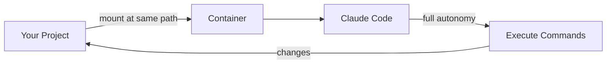

<div align="center">
  

  [](https://github.com/tsilva/claudebox/actions)
  [](https://www.docker.com/)
  [](LICENSE)
  [](https://github.com/tsilva/claudebox/commits/main)
  [](https://github.com/tsilva/claudebox)

  **⚡ Full autonomy. Zero blast radius. 🛡️**

  > *"I gave Claude full autonomy and watched it refactor my codebase. My system? Untouched."*

  

  [Docker](https://docs.docker.com/get-docker/) · [Claude Code](https://claude.ai/code)
</div>

---

## Table of Contents

- [Features](#-features)
- [Why claudebox?](#-why-claudebox)
- [Quick Start](#-quick-start)
- [Requirements](#-requirements)
- [Usage](#-usage)
- [Per-Project Configuration](#%EF%B8%8F-per-project-configuration)
- [Per-Project Dockerfile](#-per-project-dockerfile)
- [Commands](#%EF%B8%8F-commands)
- [How It Works](#-how-it-works)
- [Sandbox Awareness](#-sandbox-awareness)
- [Project Structure](#-project-structure)
- [Resource Limits](#-resource-limits)
- [Troubleshooting](#-troubleshooting)
- [Notifications](#-notifications)
- [Security](#%EF%B8%8F-security)
- [Contributing](#-contributing)
- [Community](#-community)
- [License](#-license)

## ✨ Features

- **🔒 Isolated execution** — Claude runs in a container with no access to your host filesystem (except mounted paths)
- **⚡ Full autonomy** — No permission prompts; Claude can execute any command inside the sandbox
- **🧠 Sandbox awareness** — Claude automatically knows its constraints (read-only paths, blocked directories, resource limits)
- **📁 Same-path mounting** — Your project directory is mounted at its actual path, so file paths work identically inside and outside the container
- **⚙️ Per-project configuration** — Define additional mounts and ports via `.claudebox.json` for data directories, output folders, and more
- **🐳 Per-project Dockerfile** — Customize the container with project-specific dependencies using `.claudebox.Dockerfile`
- **🔌 Plugin support** — Marketplace plugins from `~/.claude/plugins/marketplaces` are mounted read-only into the container
- **🚀 Simple setup** — One install script adds a standalone command you can run from any project

## 🤔 Why claudebox?

**The problem:** Claude Code with `--dangerously-skip-permissions` can modify any file on your system. One wrong command and your SSH keys, git config, or system files could be gone.

**The solution:** claudebox runs Claude Code in a Docker container where it has full autonomy *inside the sandbox*, but zero access to your host system except the mounted project directory.

| Without sandbox | With sandbox |
|-----------------|--------------|
| Claude can `rm -rf ~/*` | Claude can only modify your project |
| Claude can read `~/.ssh/*` | No access to SSH keys |
| Claude can modify `~/.gitconfig` | No access to git credentials |
| One mistake = system damage | One mistake = rebuild container |

**TL;DR:** Full AI autonomy, zero host risk.

## 🚀 Quick Start

**Option 1: One-liner install**
```bash
curl -fsSL https://raw.githubusercontent.com/tsilva/claudebox/main/install.sh | bash
```

**Option 2: Manual install**
```bash
git clone https://github.com/tsilva/claudebox.git
cd claudebox
./install.sh
```

Then reload your shell and head to any project directory:

```bash
cd ~/my-project
claudebox
```

## 📋 Requirements

- [Docker Desktop](https://docs.docker.com/get-docker/) on macOS (Linux/WSL2 not yet supported)
- **Optional:** `jq` for per-project configuration support (`brew install jq`)

## 💻 Usage

```bash
# Run Claude Code in the sandbox (interactive mode)
claudebox

# Non-interactive print mode: run a prompt and exit
claudebox -p "explain this code"
claudebox --print "what does main.py do"

# Pipe input to print mode
cat README.md | claudebox -p "summarize this"

# Print mode with output format for scripting
claudebox -p --output-format json "list all functions"

# Drop into a bash shell to inspect the sandbox environment
claudebox shell

# With profiles (see Per-Project Configuration)
claudebox --profile dev       # Use specific profile
claudebox -P prod             # Short form (-P uppercase)
# Combine profile with print mode
claudebox -P dev -p "run tests"

# Mount all host paths as read-only (workspace, config, extra mounts)
claudebox --readonly

# Print the full docker run command without executing
claudebox --dry-run
```

The `shell` argument is useful for debugging or exploring what tools and files are available inside the container.

Project virtualenv activation is manual. `claudebox` does not source `.venv/bin/activate` at startup, so repo-controlled shell code cannot run before Claude begins.

**Print mode** (`-p` / `--print`) runs non-interactively, executes the prompt, and exits. This is useful for scripting and automation.

## ⚙️ Per-Project Configuration

Create a `.claudebox.json` file in your project root to define named profiles with mounts and ports:

```json
{
  "dev": {
    "mounts": [
      { "path": "/Volumes/Data/input", "readonly": true },
      { "path": "/Volumes/Data/output" }
    ],
    "ports": [
      { "host": 3000, "container": 3000 },
      { "host": 5173, "container": 5173 }
    ]
  },
  "prod": {
    "mounts": [
      { "path": "/Volumes/Data/prod", "readonly": true }
    ]
  }
}
```

| Field | Required | Description |
|-------|----------|-------------|
| `<profile-name>` | Yes | Root-level keys are profile names |
| `mounts[].path` | Yes | Absolute host path (mounted to the same path inside container) |
| `mounts[].readonly` | No | If `true`, mount is read-only (default: `false`) |
| `ports[].host` | Yes | Host port number (1-65535) |
| `ports[].container` | Yes | Container port number (1-65535) |
| `network` | No | Docker network mode: `"bridge"` (default) or `"none"` for isolation |
| `audit_log` | No | If `true`, saves session logs to `~/.claudebox/logs/` (default: `false`) |
| `cpu` | No | CPU limit (e.g., `"4"`) — maps to `docker --cpus` |
| `memory` | No | Memory limit (e.g., `"8g"`) — maps to `docker --memory` |
| `pids_limit` | No | Max processes (e.g., `256`) — maps to `docker --pids-limit` |
| `ulimit_nofile` | No | Open file descriptors limit (e.g., `"1024:2048"`) |
| `ulimit_fsize` | No | Max file size in bytes (e.g., `1073741824`) |

Mounts are rejected when they target a blocked path, a child of a blocked path, or a parent path that would expose blocked children such as `$HOME` or `~/.config`.

**Git safety:** When running from a git repository, the `.git` directory is mounted read-only, preventing commits and other write operations. No SSH keys or git credentials are available in the container, so pushes will also fail. When running outside a git repo, a warning is displayed.

**Profile selection:**
- **With `--profile` or `-P`**: Use the specified profile directly
- **Without flag**: Interactive numbered menu

```bash
claudebox --profile dev   # Use specific profile
claudebox -P prod         # Short form (-P uppercase)
claudebox                 # Interactive prompt to select profile
```

> **Note:** The `-P` (uppercase) flag is used for profiles to avoid collision with Claude's `-p` (lowercase) print mode flag.

**Example use case:** A data processing project with dev and prod environments:

```json
{
  "dev": {
    "mounts": [
      { "path": "/Volumes/ExternalDrive/datasets", "readonly": true },
      { "path": "/Users/me/outputs" }
    ]
  },
  "prod": {
    "mounts": [
      { "path": "/Volumes/Production/data", "readonly": true }
    ]
  }
}
```

**Note:** Requires `jq` to be installed. If `jq` is missing or the config file is invalid, extra mounts and ports are skipped with a warning and the sandbox runs normally.

**Example use case:** Git worktrees for parallel feature development:

```bash
# Create a worktree for a feature branch
git worktree add ../myrepo-feature feature-branch

# Terminal 1: run claudebox in main worktree
cd /path/to/myrepo
claudebox

# Terminal 2: run claudebox in feature worktree
cd /path/to/myrepo-feature
claudebox
```

Each claudebox instance is scoped to its own worktree directory. Claude in the feature worktree cannot see or modify files in the main worktree, and vice versa. This prevents accidental cross-contamination when working on multiple branches simultaneously.

## 🐳 Per-Project Dockerfile

Place a `.claudebox.Dockerfile` in your project root to customize the container with project-specific dependencies. The file is a standard Dockerfile that builds on top of the base image:

```dockerfile
FROM claudebox

RUN apt-get update && apt-get install -y python3 python3-pip
RUN pip3 install pandas
```

When present, a per-project image is automatically built before each run. This lets you pre-install tools, libraries, or system packages that your project needs without modifying the shared base image.

## 🛠️ Commands

| Command | Purpose |
|---------|---------|
| `./install.sh` | Build image and install `claudebox` script to `~/.claudebox/bin/` |
| `./uninstall.sh` | Remove image, scripts, and PATH entry |
| `./scripts/claudebox-dev.sh build` | Rebuild the container image |
| `./scripts/claudebox-dev.sh update` | Pull latest changes and rebuild |
| `./scripts/claudebox-dev.sh kill` | Force stop any running containers |

## 🔧 How It Works


```mermaid
graph LR
    A[Your Project] -->|mount at same path| B[Container]
    B --> C[Claude Code]
    C -->|full autonomy| D[Execute Commands]
    D -->|changes| A
```

1. **`install.sh`** builds an OCI-compatible image and installs a standalone script to `~/.claudebox/bin/`
2. Before each launch, claudebox refreshes its isolated auth mirror from host `~/.claude.json` and `~/.claude/.credentials.json` (when present)
3. Running `claudebox` starts a container with your current directory mounted at its actual path
4. Claude Code runs with `--dangerously-skip-permissions` inside the isolated environment
5. All changes to the mounted directory are reflected in your project
6. Optional: `.claudebox.json` adds extra mounts for data directories
7. Marketplace plugins from `~/.claude/plugins/` are synced into the sandbox mirror before the container starts

## 🧠 Sandbox Awareness

At container startup, claudebox generates a `CLAUDE.md` file at `~/.claude/CLAUDE.md` inside the container. Claude Code automatically loads this file, making the AI aware of its environment constraints:

- **Filesystem restrictions** — Read-only root filesystem, writable locations (`/tmp`, `~/.cache`, etc.)
- **Blocked paths** — No access to `~/.ssh`, `~/.aws`, `~/.gnupg`, and parent mounts like `$HOME` or `~/.config` that would expose them
- **Git restrictions** — `.git` directory is read-only; commits and pushes are blocked
- **Profile settings** — Network mode, CPU/memory limits, extra mounts with access modes

This prevents Claude from attempting operations that would fail (like `git push` without credentials) and helps it work within the sandbox constraints.

## 📁 Project Structure

```
claudebox/
├── Dockerfile              # OCI-compatible image definition
├── .dockerignore           # Files excluded from build context
├── entrypoint.sh           # Container entrypoint (sandbox awareness, Claude launch)
├── install.sh              # Self-contained installer (dual-mode: curl pipe + local repo)
├── uninstall.sh            # Standalone uninstaller
├── style.sh                # Canonical terminal styling library for repo + installed CLI
├── scripts/
│   ├── claudebox-dev.sh        # Dev CLI (build/kill/update)
│   ├── claudebox-template.sh   # Standalone script template
│   ├── install-claude-code.sh  # Claude Code installer
│   ├── repo-common.sh          # Shared host-side helpers for repo scripts
│   └── seccomp.json            # Syscall filtering profile
├── tests/
│   ├── smoke-test.sh           # Basic functionality tests
│   ├── isolation-test.sh       # Filesystem isolation tests
│   ├── security-regression.sh  # Security constraint tests
│   ├── validation-test.sh      # Config validation tests
│   ├── golden/                 # Expected output fixtures
│   └── lib/                    # Test utilities
├── .github/workflows/
│   └── ci.yml              # Shellcheck + build CI
├── SECURITY.md
├── CLAUDE.md
└── README.md
```

## 📊 Resource Limits

By default, containers run without resource limits. To restrict CPU, memory, or processes, add the fields to your `.claudebox.json` profile:

```json
{
  "dev": {
    "cpu": "4",
    "memory": "8g",
    "pids_limit": 256,
    "ulimit_nofile": "1024:2048",
    "ulimit_fsize": 1073741824
  }
}
```

## 🔍 Troubleshooting

### Docker not running

If you see "daemon is not running", start Docker Desktop:

```bash
docker info  # Should show Docker daemon info
```

### "ETIMEDOUT" or "Unable to connect to Anthropic services"

This usually indicates network issues inside the container. Verify Docker has internet access:

```bash
claudebox shell
# Inside container:
curl -I https://api.anthropic.com
```

### Permission denied / UID mismatch

The container user UID is set at build time to match your host user. If you see permission errors on mounted files, rebuild:

```bash
./scripts/claudebox-dev.sh build  # Rebuilds with your current UID
```

### "Configuration file corrupted" on first run

The sandbox mirror of `.claude.json` needs to be valid JSON. Remove it and claudebox will rebuild it from your host Claude state on the next run:

```bash
rm -f ~/.claudebox/.claude.json
```

### Claude says the session is expiring soon

claudebox refreshes sandbox auth from your host Claude state on each launch. If you still see expiry warnings after upgrading, refresh your Claude login once outside the container and then start a new claudebox session.

### Per-project mounts not working

1. Verify `jq` is installed: `which jq` or `brew install jq`
2. Validate your config: `jq . .claudebox.json`
3. Check paths are absolute (start with `/`)
4. Ensure mount paths exist on the host (see `mkdir -p` hint in warnings)

### Port conflicts

If a port is already in use on the host, you'll see a bind error. Change the host port in `.claudebox.json` or stop the conflicting process:

```bash
lsof -i :3000  # Find what's using the port
```

### Docker not enough resources

If builds or runs fail with out-of-memory errors, increase Docker Desktop's resource allocation in **Settings > Resources**.

## 🔔 Notifications

For macOS desktop notifications when Claude is ready for input, install [claude-code-notify](https://github.com/tsilva/claude-code-notify) and enable sandbox support during its installation.

The notification bridge uses TCP (`host.docker.internal:19223`) to relay messages from the container to the host, where `terminal-notifier` displays them.

## 🛡️ Security

See [SECURITY.md](SECURITY.md) for details on the isolation model, what is and isn't protected, and how to report vulnerabilities.

## 🤝 Contributing

Found a bug or have an idea? [Open an issue](https://github.com/tsilva/claudebox/issues) or submit a pull request.

## 🌍 Community

- 💬 **Questions?** [Open a discussion](https://github.com/tsilva/claudebox/discussions)
- 🐛 **Found a bug?** [File an issue](https://github.com/tsilva/claudebox/issues)
- 🐦 **Share your builds** with **#claudebox** on Twitter/X

---

<div align="center">

⭐ **If claudebox saved you from AI-induced system damage, consider starring the repo!**

</div>

## 📄 License

MIT